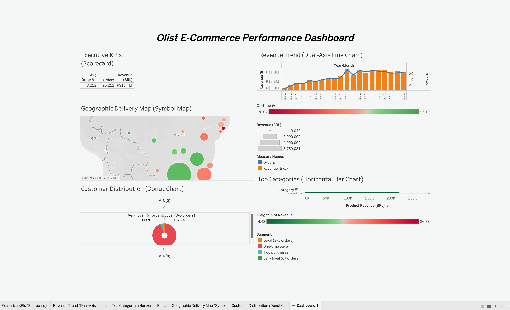

# Olist Sales, Customer & Business Intelligence Platform

An end-to-end data analytics portfolio project transforming 1.5 million rows of raw Brazilian e-commerce data into actionable business intelligence using SQL, Python, Excel, and Tableau.



---

## 1. Executive Summary
This project analyzes 96,211 delivered orders generating R$15.4M in revenue between January 2017 and August 2018 for Olist. The analysis uncovered a severe customer retention challenge (97.0% one-time buyers) and identified a critical 30-day delivery threshold strongly associated with collapsing customer satisfaction. The end product is a fully reproducible analytics pipeline bridging raw relational data, statistical analysis, and interactive executive dashboards.

## 2. Business Context
Olist is a Brazilian e-commerce marketplace connecting small businesses to broader consumer markets. Stakeholders (Operations, Marketing, and Executive leadership) required visibility into monthly revenue trends, geographic logistics bottlenecks, and customer purchasing behavior to guide strategic investments in marketing and freight subsidies.

## 3. Key Business Questions
1. **Revenue:** What is the true monthly revenue trend, and how do categories rank?
2. **Customers:** What proportion of customers return, and how concentrated is our revenue?
3. **Logistics:** Which geographic regions suffer from the highest delivery failure rates?
4. **Satisfaction:** How strongly are delivery times associated with customer review scores?
5. **Efficiency:** Which product categories carry the highest freight burden relative to product revenue?

## 4. Key Findings
* **The Retention Crisis:** 97.0% of customers are one-time buyers. The business is heavily dependent on constant new customer acquisition.
* **Revenue Concentration:** The top 10% of customers generate 58.3% of total revenue—a steeper concentration than the standard 80/20 rule.
* **Delivery & Satisfaction:** Late deliveries were associated with a severe drop in average review scores (from 4.29 to 2.57). Specifically, deliveries taking >30 days saw average scores collapse to 2.18.
* **Category Shifts:** Health & Beauty overtook all other categories to become the #1 revenue generator in 2018 (up 59.5% YoY), while holding favorable freight ratios.
* **Geographic Risk:** São Paulo (SP), Rio de Janeiro (RJ), and Minas Gerais (MG) account for 64.6% of total revenue, highlighting extreme geographic concentration.

## 5. KPI Snapshot
*(Metrics based on delivered orders between Jan 2017 – Aug 2018)*
* **Total Delivered Revenue:** R$ 15,389,095
* **Total Delivered Orders:** 96,211
* **Median Order Value (AOV):** R$ 105.28
* **On-Time Delivery Rate:** 91.9%
* **Average Review Score:** 4.16 / 5.0
* **Repeat Buyer Rate:** 3.0%

## 6. Project Architecture
`Raw CSVs` → `Python Pandas (Cleaning & Derived Columns)` → `DuckDB (SQL Analysis)` → `Python (Statistical EDA)` → `Pre-Aggregated CSVs` → `Tableau & Excel (Visualizations)`

## 7. Data Model & "Fan-Out" Prevention
The raw data consisted of 9 tables in a Snowflake schema. 
* **Key Challenge:** `orders` have a one-to-many relationship with both `items` and `payments`. A standard `LEFT JOIN` across all three tables causes severe row multiplication, artificially inflating revenue.
* **Solution:** Payments and items were strictly pre-aggregated to the `order_id` grain *before* joining to the master orders table, ensuring accurate revenue calculations and preserving the correct analytical grain.

## 8. SQL Analysis
The SQL phase answers 20 complex business questions using **DuckDB**.
* **Techniques Used:** Common Table Expressions (CTEs), Subqueries, Conditional Aggregation (`CASE WHEN`), Window Functions (`LAG`, `ROW_NUMBER`, `DENSE_RANK`, `PARTITION BY`, `SUM OVER` for running totals), and Safe Division (`NULLIF`).

## 9. Python EDA (Exploratory Data Analysis)
The Python phase focused on statistical distributions and visualizations.
* **Statistical Highlight:** Identified a strong right-skew in Order Value (Skewness = 9.37). The mean AOV (R$160) was heavily distorted by outliers (max order R$13K+). Consequently, **Median AOV (R$105)** was selected as the standard metric for executive reporting to accurately represent the typical customer.

## 10. Excel Dashboard
A 5-sheet professional workbook demonstrating advanced spreadsheet reporting.
* Features KPI scorecard layouts, nested Conditional Formatting (Traffic lights, Data Bars, Color Scales), and line/bar/pie charts built dynamically from the cleaned data.

## 11. Tableau Dashboard
An interactive, executive-level dashboard.
* **Design Strategy:** To guarantee performance and data integrity, 5 pre-aggregated, grain-controlled CSVs were generated in Python specifically for Tableau. This completely eliminated the risk of join errors in the BI layer. 
* Includes dynamic map filtering, dual-axis charts, and KPI scorecards.

## 12. Business Recommendations
1. **Launch a 90-Day Re-engagement Campaign:** Because the median time to second purchase is 110 days, marketing should target one-time buyers with incentives around day 90 to protect the revenue pipeline.
2. **Establish a 30-Day Delivery SLA:** Orders taking longer than 30 days are associated with unacceptable customer satisfaction levels (2.18 average score). Heavy geographic bottlenecks (e.g., Alagoas, Maranhão) require dedicated logistics interventions.
3. **Review Heavy-Item Freight Pricing:** Categories like Office Furniture cost 42.8% of product revenue in freight. Minimum order values or localized shipping restrictions should be evaluated.

## 13. Data Quality & Methodology
* **Duplicate Reviews:** Discovered a system bug where 789 identical `review_id`s mapped to different `order_id`s. Standardized to join strictly on `order_id`.
* **Boolean Handling:** Converted True/False delivery flags to 1/0/NaN numeric indicators, enabling rapid `AVG()` calculations for success rates while gracefully handling missing data.
* **Missing Dates:** Identified and filtered 8 edge-case orders marked "delivered" but missing actual delivery timestamps.
* **Date Filtering:** Core Tableau visualizations and top-level KPIs filter for 2017 and 2018 data only, removing 267 incomplete records from late 2016 to ensure accurate trend analysis.

## 14. Key Analytical Decisions
### Controlling Analytical Grain
A naive join between `orders`, `order_items`, and `order_payments` produces 115k+ rows for 96k orders, inflating revenue metrics. To prevent this, payment data and item data were mathematically pre-aggregated up to the order level (the core grain) *before* being introduced to customer and geographic data.

### Choosing the AOV Metric
Because the dataset is heavily right-skewed (few customers buying very expensive items), using the mean order value (R$160) creates a false impression of the typical customer. Median AOV (R$105) was deliberately chosen for reporting to provide a robust central tendency metric.

### Correlation vs. Causation
While late deliveries are strongly associated with lower review scores (Pearson r = -0.34), this project avoids stating they purely *cause* bad reviews, acknowledging that other factors (like product quality or seller communication) likely compound the issue.

## 15. Repository Structure
```text
├── data/
│   ├── raw/               # Original Kaggle CSVs (gitignored)
│   ├── cleaned/           # Post-Pandas processed data
│   └── tableau/           # Pre-aggregated grain-controlled CSVs
├── excel/
│   └── olist_sales_analysis.xlsx
├── notebooks/
│   ├── 01_data_cleaning.ipynb
│   └── 02_eda_and_analysis.ipynb
├── reports/
│   ├── figures/           # Exported Matplotlib/Seaborn charts
│   └── tableau/           # Tableau dashboard screenshots
├── sql/
│   ├── 01_revenue_and_sales.sql
│   ├── 02_customer_analysis.sql
│   ├── 03_profitability_operations.sql
│   └── 04_advanced_window_functions.sql
└── README.md
```

## 16. Project Assets
- [SQL Analysis Scripts](sql/)
- [Python Data Cleaning & EDA Notebooks](notebooks/)
- [Excel Executive Workbook](excel/)
- [Tableau-Ready Datasets](data/tableau/)
- [Exploratory Analysis Figures](reports/figures/)

## 17. Tech Stack
* **Database:** DuckDB, SQL
* **Data Processing & Stats:** Python (Pandas, NumPy, Matplotlib, Seaborn)
* **Visualization & BI:** Tableau, Microsoft Excel (openpyxl)

## 18. Limitations & Next Steps
* **Limitations:** The dataset terminates in August 2018, leaving Q3 2018 incomplete for YoY analysis. Analysis lacks product margin/COGS data, so profitability is approximated via freight-to-revenue ratios.
* **Next Steps:** Implement predictive modeling (e.g., Logistic Regression or Random Forest) to predict repeat customer probability based on first-order variables.
